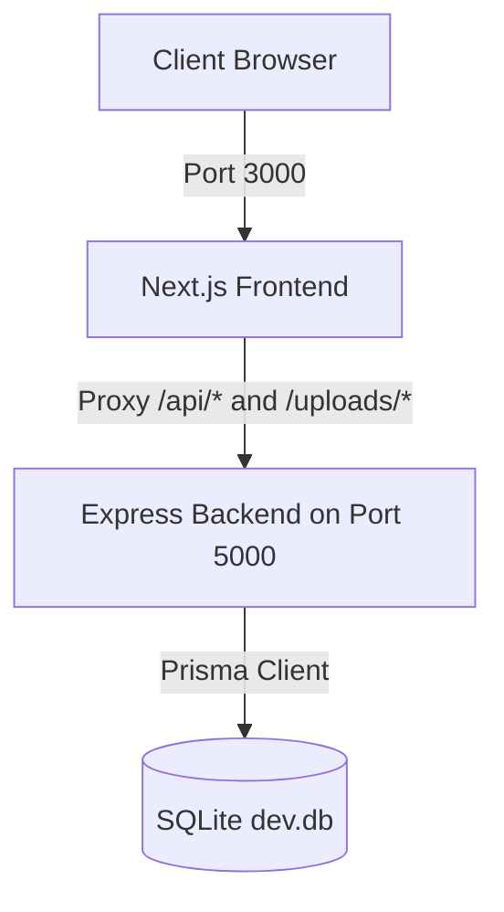

# CareerWave - Decoupled Job Board Application

CareerWave is a modern, responsive job board platform that connects **Job Seekers** and **Employers** with an **Admin** moderation panel.

This project is structured as a decoupled architecture:
- **Frontend**: Next.js 14 (App Router) with TypeScript and Tailwind CSS, running on port `3000`.
- **Backend**: Express.js server written in TypeScript running on port `5000`, using SQLite database with Prisma ORM.

---

## Architecture Overview



- Next.js rewrites in `frontend/next.config.js` act as a reverse proxy, mapping `/api/*` and `/uploads/*` calls automatically to the backend Express server on port `5000`.
- HTTP-only cookie-based authentication (`auth_token`) flows seamlessly through the proxy, eliminating CORS complexity.

---

## Getting Started

### 1. Execute Setup & Migration Script
From the root workspace directory, run the project migration script to install all packages (root, frontend, backend), build Prisma schemas, and seed mock profiles:
```bash
npm run setup
```

### 2. Run both Frontend and Backend
Launch both the frontend client and the backend API server concurrently:
```bash
npm run dev
```
- Open **`http://localhost:3000`** to view the frontend.
- Backend API server runs on **`http://localhost:5000`**.

---

## Default Login Credentials

### 1. Job Seeker
- **Email**: `seeker@wave.com`
- **Password**: `seeker123`
- **Features**: Bookmark listings, view application stage trackers, send inbox messages, receive notifications.

### 2. Employer / Recruiter
- **Email**: `recruiter@stripe.com`
- **Password**: `recruiter123`
- **Features**: Post new positions, manage applicants via Kanban pipeline, talent search, internal notes/reviews.

### 3. Administrator
- **Email**: `admin@wave.com`
- **Password**: `admin123`
- **Features**: Block user accounts, delete job listings, monitor global platform stats.
